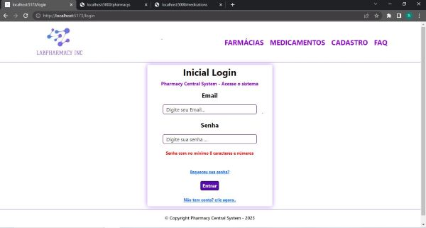
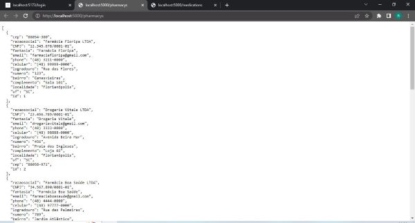
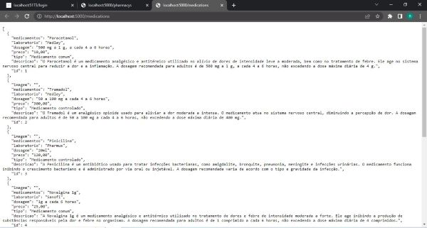
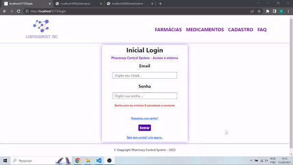

## Projeto Avaliativo do Módulo1
### LAB365- FullStack - Itaguaçu

#### Criação de sistema de gerenciamento de Farmácias e Medicamentos com React
#### Nome do sistema: Pharmacy Central System 

### 🔗 Links
[](https://github.com/ricardo-werner)

[](https://www.linkedin.com/in/ricardo-werner)


Status - Concluído

### Demonstração

Tela do Pharmacy Central System
<p align="center">
  
</p>

Tela do arquivo json com os dados das farmácias
<p align="center">
  
</p>
Tela do arquivo json com os dados dos medicamentos
<p align="center">
  
</p>
Video do Pharmacy Central System
<p align="center">
    
</p>


### O Desafio
Neste projeto foi proposto criar um sistema para controlarmos a rede de farmácias e os medicamentos de forma online codificado em React.

### Requisitos da Aplicação

| Item  | Descrição                                            
| ----- | ---------------------------------------------------------------------- |
|  1    |  O sistema deverá ser desenvolvido em React.                           |
|  2    |  O sistema deverá seguir o Roteiro da Aplicação.                       |
|  3    |  Modelagem do layout, formatos, tipografias. cores e organização livre.|
|  3.1  |  Opcional a utilização do Bootstrap ou Style components.               |
|  4    |  Deverá ser gravado um vídeo de apreentação do sistema.                |

### Formato do Sistema

| Item                   | Descrição                                            
| ---------------------- | ----------------------------------------------------- |
|  Login                 | Pág. com email e senha obrigatórios.                  |
|  Cad. Farmácia         | Pág. com os principais dados da farmácia e cep.       |
|  Cad. Medicamento      | Pág. com as principais informações e tipo.            |
|  Lista de Farmácias    | Pág. com uma tabela com modal para exibição de todas as farmácias  |        
|  Lista de Madicamentos | Pág. com cards com modal para a exibição de todos os medicamentos. |
|  Menu Navegação        | Barra superior da página com logo e links para todas as páginas acima.|
|  Rodapé                | Barra inferior da página com informações de propriedade intectual e desenvolvedor.|
|  Extra                 | Pág. de cadastro de usuário.                          |
|  Extra                 | Pág. de FAQ                                           |

### Plano do Projeto

No desenvolvimento desta aplicação, colocamos em prática:

| Item  | Descrição                                            
| ----- | ------------- |
|  1    |  HTML         |
|  2    |  CSS          |
|  3    |  JavaScript   |
|  3.1  |  React        |
|  4    |  Skills       |

### Tecnologias utilizadas:

- Visual Studio Code
- NodeJS (compilação Vite - página oficial - https://vitejs.dev/ )


Por ainda ser uma estrutura nova para mim, este projeto ajudou no desenvolvimento da utlização do React - framework e me mostrou como ele flexível e escalável. Utilizando suas ferramentas e bibliotecas, ficou mais fácil entender suas estruturas de exportação e importação dos componentes, criação de rotas, aplicação dos componentes de estilição (css, bootstrap e react-bootstrap) e pensar em como estruturar uma aplicação de forma à facilitar as futuras manutenções.

## Para utilizar este projeto como base, faça o seguinte passo-a-passo:

Clone o projeto para a sua máquina
```bash
git@github.com:ricardo-werner/LAB365-FullStack-M01-ProjFinal-LABPharmacy.git
```
Obs: necessário configurar SSH [(veja como clicando aqui)](https://www.youtube.com/watch?v=n-H1eFSsugo)

Instale as dependências.
Nota - para rodar este comando é necessário ter instalado no computador o NodeJS e o Node Package Manager(NPM)

```bash
npm install
``` 

- Rode o servidor

```bash
npm run server
```

- Rode o projeto

```bash
npm run dev
```

### Observações

Este projeto vem com o [JSON Server](https://www.npmjs.com/package/json-server) instalado e configurado.

Este projeto já vem com o Bootstrap 5 e react-bootstrap instalado e configurado.

login - teste@teste.com.br
pwd - 123456789


## Autor

Ricardo Werner - 
Dev FullStack em desenvolvimento - 
LAB365-FullStack-Itaguaçu
